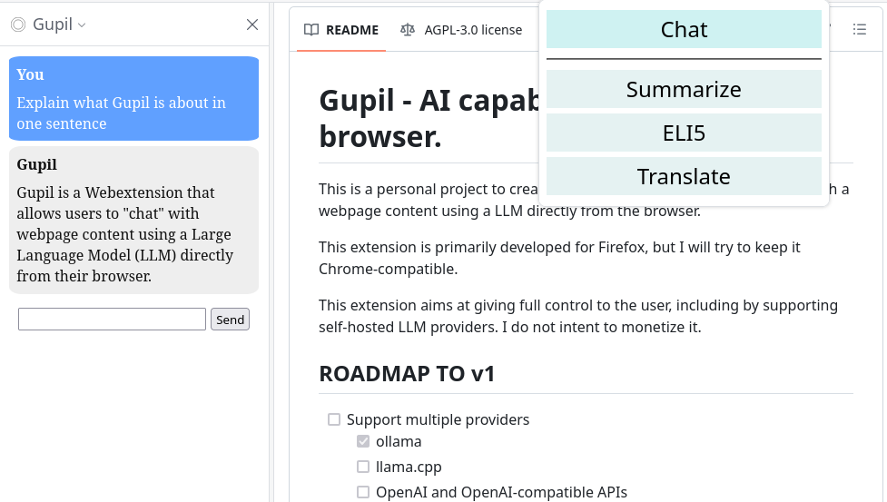

# Gupil - AI capabilities in your browser.

This is a personal project to create a Webextension that allows to "chat" with a webpage content using a LLM directly from the browser.

This extension is primarily developed for Firefox, but I will try to keep it Chrome-compatible.

This extension aims at giving full control to the user, including by supporting self-hosted LLM providers. I do not intent to monetize it.

## ROADMAP TO v1
- [ ] Support multiple providers
  - [X] ollama
  - [X] llama.cpp
  - [X] OpenAI and OpenAI-compatible APIs
- [X] Configurable quick actions
- [X] Complete i18n with at least english and french
- [X] Visual indicator when waiting for model
- [X] Visual indicator when model error
- [X] Replace placeholder icon
